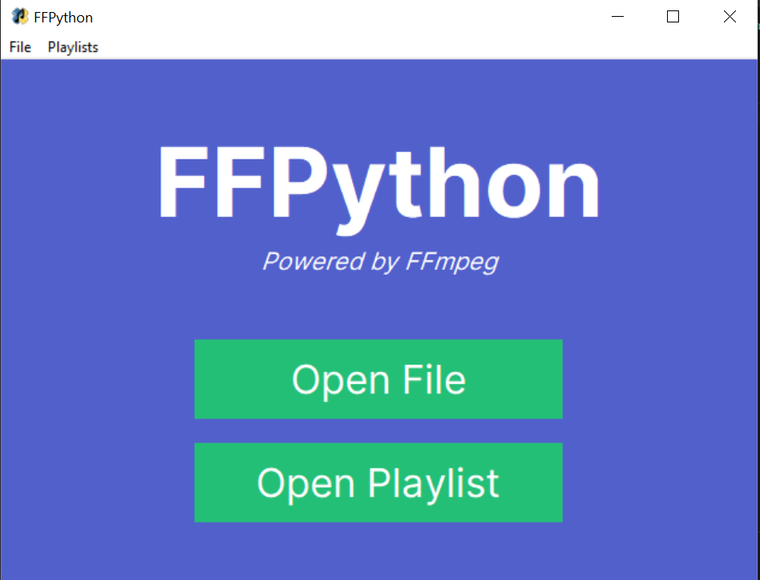
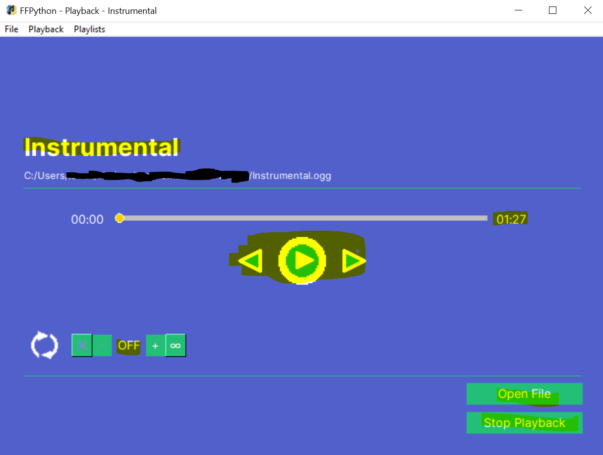
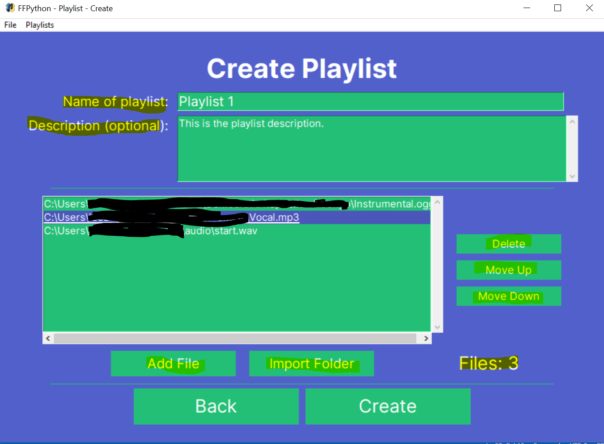
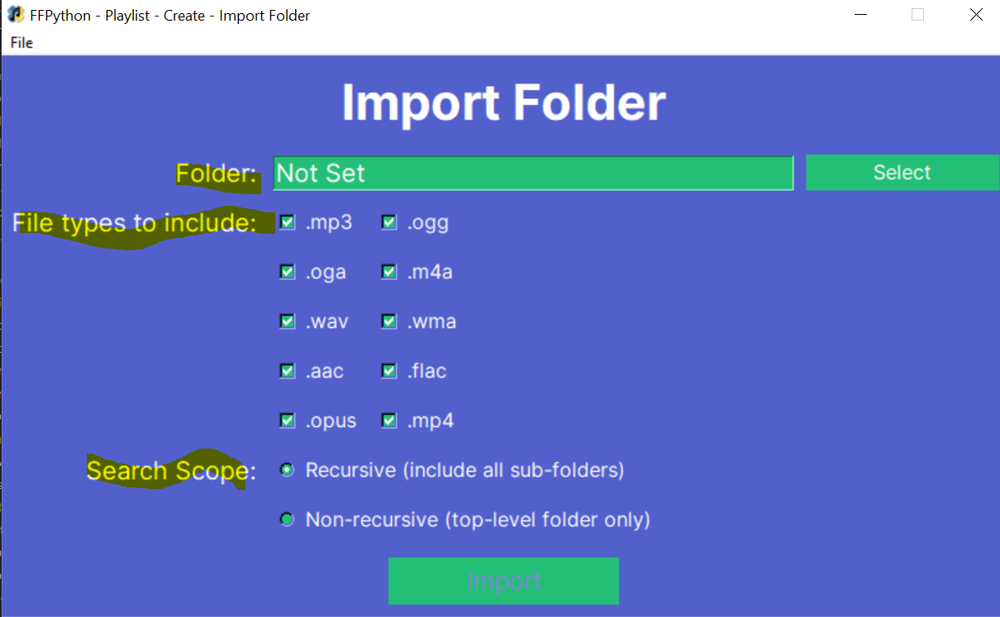
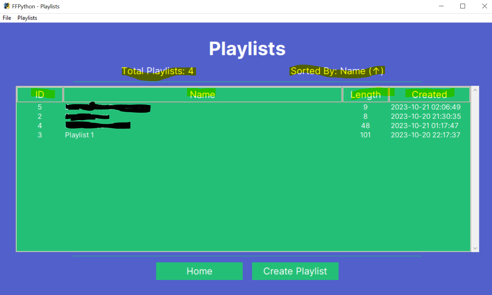
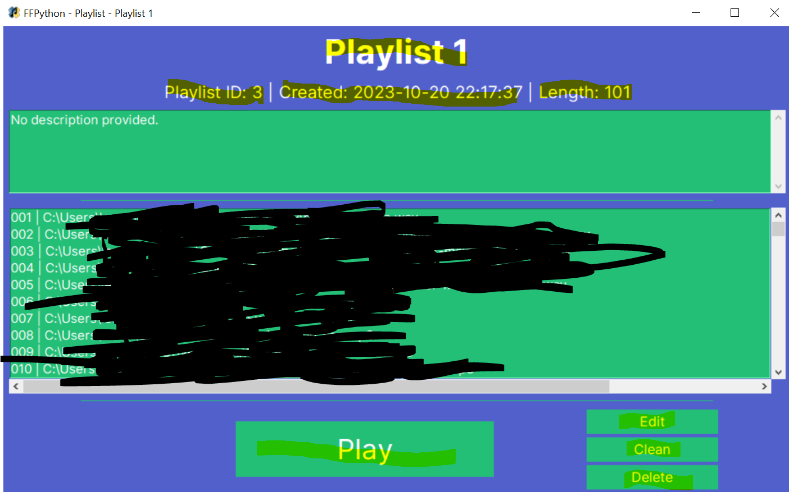
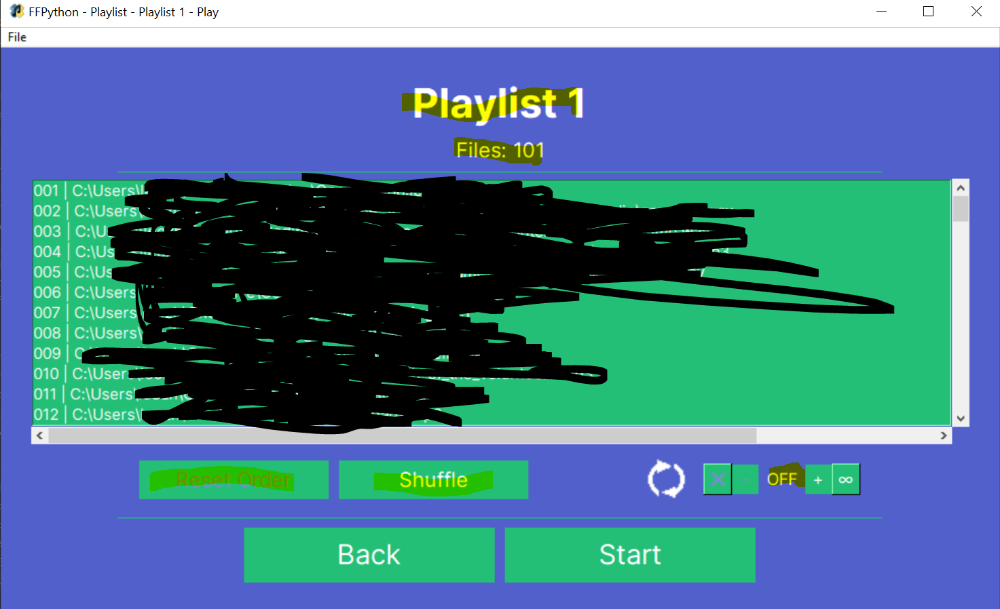
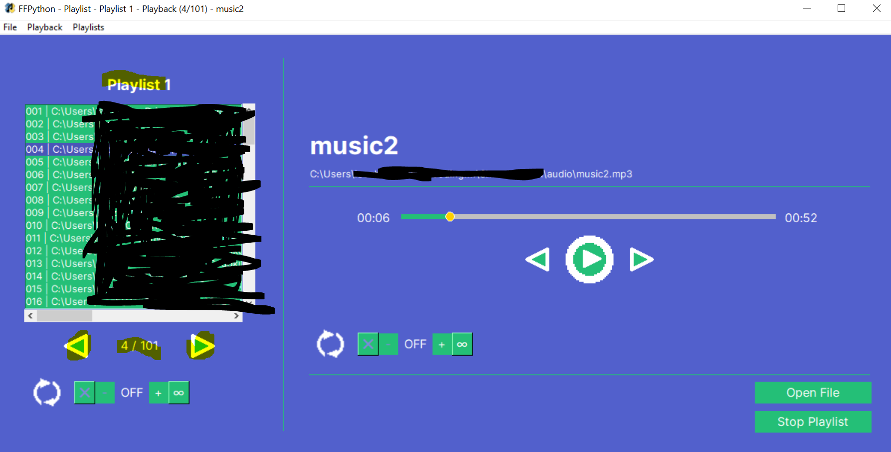

# FFPython - Tutorial

Welcome to FFPython! This tutorial will provide you with the necessary information to play audio and use the various features provided in the app. Note, for brevity, not all features will be discussed here, feel free to explore the app to discover more advanced features you are not particularly likely to use (including looking at the source code as required).

## Playing a File

Upon launching the app, you should see the following screen:

If so, great! Next, press on the Open File button, or use the keybind Ctrl + O which will prompt you to select an audio file to play. Simply choose the file to play, and provided it is valid and you have set up FFmpeg correctly, the file should be successfully loaded and something similar to this should be displayed: 

And so, the audio will play as expected. The key features are highlighted. Here is the list of points to note regarding playback and the various playback controls:

- The **title** is shown in the large font at the top, and will be shortened with an ellipsis if too long to display. This is derived from the file name with the extension removed. In the example, the loaded file is called `Instrumental`.

- The **file path** is shown below the title, and its display will also be shortened if necessary. In this case, the file path is `C:/Users/.../Instrumental.ogg` (full path hidden in the example).

- The **current time** in the audio is displayed to the left of the playback bar. Right now, since the audio was just loaded, the current time in the audio is `00:00`.

- The **duration** of the audio is displayed to the right of the playback bar, `01:27` above.

- To **pause**, **resume** or **replay** the audio, simply click on the big button between the two arrows and the state will change accordingly. The spacebar can be used too. Replay will occur when audio has finished playing and you would like to play again. The button display will also change accordingly, i.e. right now the playback is paused and pressing the button will resume the audio.

- To **seek back or forward** 10 seconds, press either of the arrows below the playback bar. You can also use the arrow keys (← and →) to do so.

- To **seek anywhere** in the playback, you can either click on the appropriate location in the playback progress bar or drag the orange circle to the desired time. For example, to seek to the middle of the file, click on the middle of the playback bar or drag the circle to the middle.

- The **looping** widget is at the bottom left corner. There are 3 states of looping:
    - OFF - do not loop - once the audio is done, stop.
    - A finite number (max 99) - repeat the audio a fixed number of times. Use the + button to add a loop and the - button to remove a loop.
    - Infinite - Press on the ∞ button to loop the audio indefinitely until you decide to stop it.

- The **Open File** button at the bottom right will allow you to open another file. Ctrl + O can be used too. When initiated, the current playback will stop and the newly selected file will be played.

- The **Stop Playback** button simply stops the current playback and returns to the home screen.

This is the gist of the playback functionality. Feel free to play around with the features to understand them better.

## Playlists

Audio playback is great, but the app goes much further by allowing you to create, edit, delete and play playlists.

### Creation

From the home/playback screen, click on the Playlists menu at the top of the window. A sub-menu will open called Create, simply click on this and you should be brought to the creation window. An already filled create playlist form is shown below:

The key steps and features in creating a playlist are:

1. Give your playlist a suitable **name** (max 100 characters, must be unique in the app).

2. Optionally, give your playlist a **description** (max 2000 characters).

3. Add the files (min 2, max 1000).
    - There are 2 methods to adding a file. The simple but less powerful way is to simply press **Add File** (or Ctrl + O) to select a single file to add. The more powerful way is to import an entire folder by pressing the **Import Folder** button (or Ctrl + I). You will be brought to the following sub-window:

        

        Here, you can select the **folder** to import, the audio **file types** to include, and whether or not to recursively import files. A recursive search scans all sub-folders for matching files as well as the main folder, a non-recursive search only scans the toplevel folder. Once done, the matching files will be added to the playlist.
    - Back to the main create form, you can select a file path in the playlist list box and using the buttons to the right, delete the file from the playlist, or move the file up or down the playlist.

4. Click on the **Create** button to add the playlist, rendering it ready to be played.

### Viewing and Opening

The playlists you have created can be viewed and opened in a table. This can be accessed from the home screen (Open Playlist), or from the Playlist menu at the top (click View).

You should see something like this provided you have created at least one playlist:

Key points to note:

- The total number of playlists is displayed at the top.

- The internal **playlist ID**, playlist **name**, playlist **length** (number of files), and the **date/time created** are all shown for each playlist. For example, for playlist ID `3`, its name is `Playlist 1`, it has `101` files and it was created at around 22:17 on 20th October 2023.

- You can **sort** the table of playlists by click on the field headings (ID, Name, Length, Created). The first click will sort in ascending order. To invert the order (descending), click on the same heading again. This is particularly useful if you decide to commit to this app and create lots of playlists!

- Click into a playlist row, and you will be shown the following sub-window format:

Key points to note:

- The playlist name and metadata are displayed at the top of the window.

- The playlist files are displayed in order in the list box, with their position indicated on the left.

- There are four buttons at the bottom of the window all relating to the playlist: Edit, Clean, Delete and of course, Play. They will be discussed in their own sections.

### Editing

Click the Edit button from the playlist window to edit the playlist. You will be directed to the playlist form, like creating a playlist, except the fields will be filled in with the existing data. Follow the guide of creating a playlist here, since everything is the same except you are modifying an existing playlist instead of creating a new one. Hence, click on the Edit button at the bottom of the window, and the playlist will be successfully edited provided everything is valid.

### Cleaning

Firstly, cleaning a playlist means to remove files from a playlist which **no longer exist**, to avoid playback errors due to missing files. To clean a playlist, click the Clean button in the playlist window, confirm, and the playlist will be edited so that any non-existent files will be deleted from the playlist.

### Deletion

If something does not go to plan or you simply do not want to use a playlist anymore, you can delete the playlist by clicking on the Delete button in the playlist window. **WARNING: This CANNOT be undone - deleted playlists are gone FOREVER**.

### Playing

At last, here is the guide on how to play a playlist once you have created it. To get started, click on the Play button in the playlist window, and you will be brought to a screen like so:

Key points to note:

- You can view the files to be played, and the order.
- To **shuffle** the playlist (for this session only), click on the Shuffle button (or Ctrl + S), and the playback order will be randomised.
- To **reset** the playlist order, click on the Reset Order button (or Ctrl + R).
- Like single files, a playlist can be **looped**, so once the playlist finishes, it can be replayed automatically. You can turn playlist looping off, set 1 to 9 loops, or loop infinitely. The same widget is used as the playback looping widget.
- Once ready, click the Start button and the playlist playback will begin!

Once the playlist is playing, the window will look like this:

Final key points to note:

- The left is the playlist playback menu and the right is the playback GUI as usual. Refer to the playback functionality since everything remains the same.

- You can **click on any of the files** in the list box to immediately stop the current playback and play the selected file.

- The playlist **progress** is displayed below the list box. In this example the current progress is `4/101`.

- To go **back or forward** a file, use the arrows around the progress display. The arrow keybinds are already used for playlist seeking so will not work.

- The **looping** can be changed even during playback using the looping widget.
